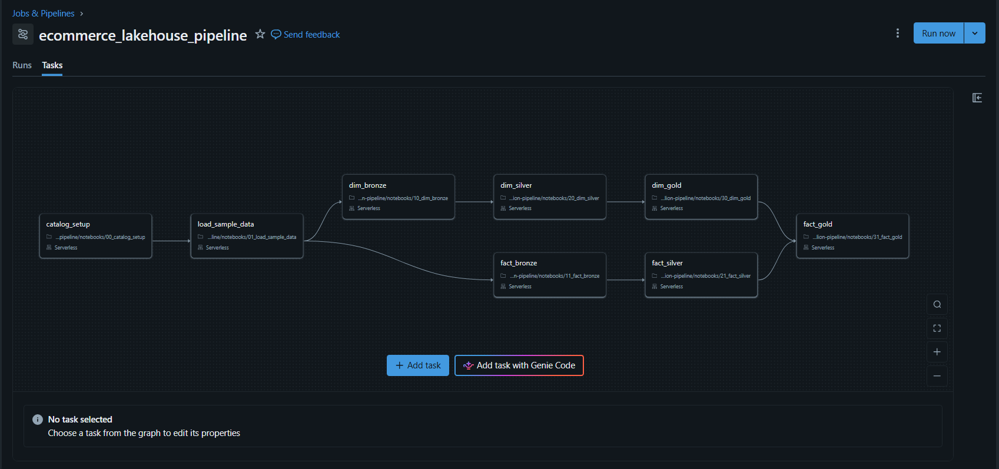
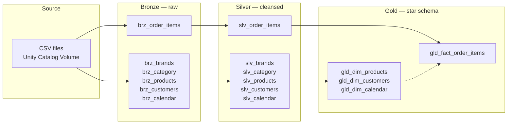
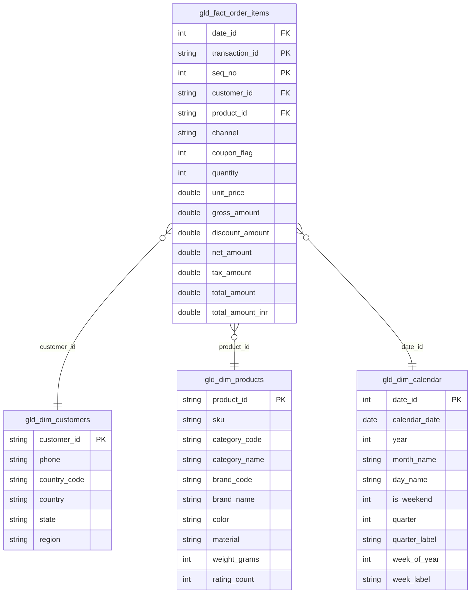
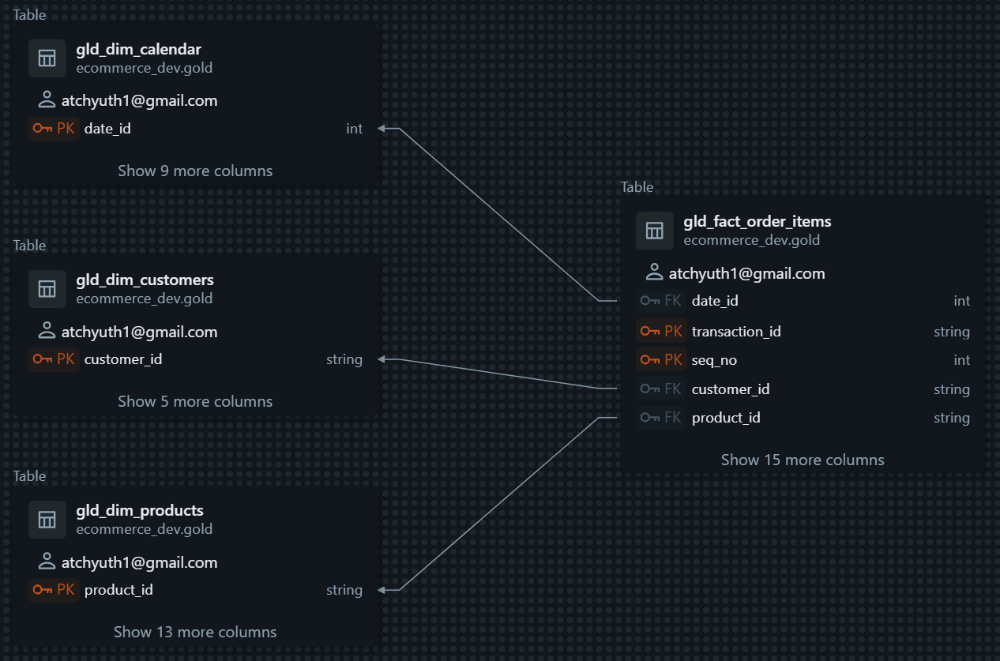
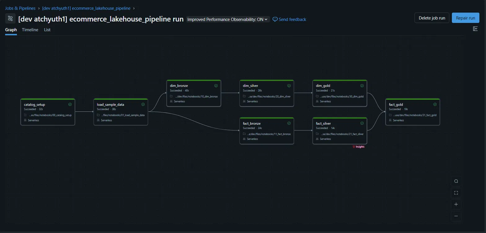

# E-Commerce Lakehouse — Databricks Medallion Pipeline

A production-shaped batch pipeline that ingests raw e-commerce CSVs, cleanses them
through a medallion architecture, and publishes a dimensional star schema for BI
consumption. Built on Databricks with Unity Catalog and Delta Lake.

Runs end to end on **Databricks Free Edition** with serverless compute. The pipeline
is deployed as a Databricks Asset Bundle — one command provisions the eight-task job
and targets a chosen catalog. Sample data is included.



---

## Architecture



### Layer contracts

Each layer has a defined responsibility, and the boundaries are enforced rather
than incidental.

| Layer | Responsibility | Rules |
|---|---|---|
| **Bronze** | Ingestion | Schema-on-read with explicit `StructType` definitions. No cleansing — anomalies are preserved so the silver layer can be tested against real defects. Audit columns (`_source_file`, `_ingested_at`) added on write. |
| **Silver** | Cleansing | Type casting, deduplication, standardization. No joins and no business logic, so every silver table maps 1:1 to its bronze source. |
| **Gold** | Publishing | Joins, enrichment, derived measures. Publishes business columns only — audit columns stop at silver; lineage is recoverable by joining back on the business key. |

---

## Star schema

`gld_fact_order_items` is the transaction fact at one row per
`(transaction_id, seq_no)`, joined to three conformed dimensions.



**Measures.** `gross_amount` (quantity × unit price), `discount_amount`,
`net_amount` (pre-tax), `total_amount` (tax-inclusive), and `total_amount_inr`
for cross-currency reporting.

The schema is declared in Unity Catalog, not just diagrammed — each dimension
carries a primary key, the fact a composite primary key on
`(transaction_id, seq_no)`, and three foreign keys resolve to the dimensions:



---

## Source data and the defects it contains

The sample data deliberately mirrors the kind of mess real source systems emit.
The silver layer exists to handle it, so the defects are the interesting part.

| Entity | Defects handled |
|---|---|
| **order_items** | Quantities spelled as words (`"Two"`), currency symbols in prices (`$49.99`), percent signs in discount rates (`21%`), two timestamp formats in one column, duplicate `(order_id, item_seq)` line items re-emitted with corrections in a later batch, non-numeric characters in tax amounts |
| **products** | Misspelled materials (`Coton`, `Ruber`, `Alumium`), unit suffixes on weights (`450g`), comma decimal separators (`12,5`), inconsistent code casing, negative and null rating counts |
| **brands** | Non-standard category codes (`GROCERY` vs `GRCY`), whitespace padding, punctuation in brand codes |
| **customers** | Missing customer identifiers, null phone numbers, state codes requiring country-scoped region mapping |
| **calendar** | Negative week-of-year values, duplicate dates, inconsistent day-name casing |

`order_items` arrives as 50+ CSV files in a landing directory, simulating daily
batch drops rather than a single bulk extract.

---

## Data quality

Two complementary mechanisms, because they do different jobs.

**Runtime assertions** run at the end of each gold notebook and fail the job task
on violation:

- Grain uniqueness — one row per `product_id`, `customer_id`, and `date_id` in the
  dimensions; one row per `(transaction_id, seq_no)` in the fact
- Key nullity — no null keys in any published table
- Referential integrity — every fact row resolves to an existing member in all
  three dimensions

**Unity Catalog constraints** declare primary and foreign keys on the gold tables.
These are informational rather than enforced, so they don't replace the assertions —
but the query optimizer uses them to eliminate redundant work, BI tools read them to
auto-detect relationships, and they make the schema discoverable in Catalog Explorer
without reading this file.

The assertions enforce; the constraints describe.

---

## Repository layout

```
.
├── databricks.yml                 # Bundle definition, dev/prod targets
├── README.md
├── conf/
│   ├── config.py                  # Catalog/schema constants, widget parameterization
│   └── reference_data.py          # Static business lookups (regions, FX rates)
├── data/sample/                   # Sample CSVs, mirrors the volume structure
├── docs/images/                   # Pipeline screenshots
├── notebooks/
│   ├── 00_catalog_setup.py        # Unity Catalog objects and volume skeleton
│   ├── 01_load_sample_data.py     # Copies sample CSVs into the raw volume
│   ├── 10_dim_bronze.py           # Dimension ingestion
│   ├── 11_fact_bronze.py          # Order items ingestion
│   ├── 20_dim_silver.py           # Dimension cleansing
│   ├── 21_fact_silver.py          # Order items cleansing
│   ├── 30_dim_gold.py             # Dimension publishing
│   └── 31_fact_gold.py            # Fact publishing
└── resources/
    └── job.yml                    # Job definition: task DAG and dependencies
```

---

## Running it

**Prerequisites:** a Databricks workspace (Free Edition is sufficient) with Unity
Catalog enabled and permission to create a catalog.

### Deploy the bundle

```bash
databricks auth login --host https://<your-workspace>.cloud.databricks.com
databricks bundle validate
databricks bundle deploy -t dev
databricks bundle run ecommerce_lakehouse_pipeline -t dev
```

`-t dev` and `-t prod` differ only in the catalog they target — the same code
deploys to either. Bootstrap tasks run in sequence, then the dimension and fact
tracks run in parallel through bronze, silver, and gold, converging at the fact
table.



### Or run the notebooks directly

Clone the repository as a Databricks Git folder (**Workspace → Create → Git
folder**), then run `notebooks/00` through `31` in numerical order. A **Target
catalog** widget appears at the top of each notebook, defaulting to `ecommerce`.

---

## Engineering notes

**One value controls the deployment target.** The catalog name flows through five
layers without any of them knowing about the others: the bundle target sets a
variable, `resources/job.yml` reads it as a job parameter, Databricks passes job
parameters to notebooks as widgets, `conf/config` reads the widget and derives the
schema and volume paths, and every table reference is built from those constants.
Deploying to a different catalog is a one-word change in `databricks.yml`; no
notebook contains a hardcoded catalog name.

**Configuration is declared once.** Catalog, schema, and volume paths live in
`conf/config` and are pulled into each notebook via `%run`. Static business lookups
— region mappings and FX rates — live in `conf/reference_data`, imported only by the
two gold notebooks that need them, so each notebook's dependencies are visible at
the top of the file.

**Transformations are named functions.** Every cleansing step is a small function
composed with `DataFrame.transform()` rather than a chain of anonymous
reassignments. Each step is individually testable and the pipeline cell reads as a
table of contents:

```python
df_silver_order_items = (
    df_bronze_order_items
    .transform(deduplicate_order_items)
    .transform(parse_quantity)
    .transform(clean_monetary_columns)
    .transform(standardize_categoricals)
    .transform(cast_temporal_columns)
    .withColumn("_processed_at", F.current_timestamp())
)
```

**Bronze is all-string by design** for `order_items`. The source emits mixed formats
that would null out or fail on a typed read; landing them as strings preserves the
raw values and pushes parsing into a layer where it can be handled explicitly.

**Deduplication is deterministic.** Order line items are deduplicated on
`(order_id, item_seq)` using a window ordered by source filename, so a corrected row
arriving in a later batch supersedes the original. A plain `dropDuplicates()` keeps
an arbitrary row — which passes on a clean dataset and silently corrupts the fact
table on a dirty one.

**Dimension attributes join on their own keys.** Product category and brand names
are resolved from the product's own `category_code` and `brand_code` rather than
through an intermediate brand-to-category bridge, which avoids both attribute
mismatch and row fan-out when a brand spans multiple categories.

**Column projections are allowlists.** Gold tables use explicit `select()` rather
than `drop()`, so a new upstream column never leaks into a published table.

**No schema evolution flags.** Every write is a plain `mode("overwrite")`. Earlier
versions carried `mergeSchema: true` to accommodate an in-place type change in the
calendar transformation; that was resolved by emitting label columns alongside the
numeric originals instead of overwriting them. With the flags removed, an unintended
schema change fails loudly rather than being silently absorbed.

**Reproducibility is verified, not assumed.** The pipeline was validated by
deploying to an empty catalog and running the full DAG from scratch — which caught a
cell reading a table that a later notebook creates, a bug invisible in a workspace
where that table already existed.

**Idempotency is tested, not assumed.** Every notebook is verified by running the
deployed job twice in succession against a fresh catalog. The second run is the one
that matters: it exercises the constraint-drop paths, the conditional guards for
objects that don't exist on a first run, and any append that should have been an
overwrite.

---

## Design decisions and known limitations

**Orphaned fact rows are preserved, not filtered.** The referential integrity check
initially failed on 207 order line items whose `customer_id` had been dropped in
silver for being null. Those rows carry valid products, dates, and revenue — the
only missing piece is customer attribution. They are mapped to an Unknown dimension
member (`customer_id = '-1'`) rather than discarded, so revenue reconciles to source
and the attribution gap stays queryable. Filtering them would have silently
understated every unfiltered aggregate and hidden an upstream data quality problem.

**Bronze records ingestion time, not arrival time.** `_ingested_at` is set with
`current_timestamp()` at write, which Spark evaluates once per batch — every row in
a run shares a timestamp regardless of which file it came from. That makes it
useless for ordering records across batches, so deduplication orders by
`_source_file` instead, relying on the date encoded in the filename. Auto Loader
would expose real per-file metadata including modification time, removing the
dependency on a filename convention.

**Constraint dependencies constrain the load order.** Because the pipeline
full-refreshes its dimensions, each run must drop and recreate their primary keys —
and a primary key cannot be dropped while a foreign key references it. The dimension
notebook therefore releases the fact table's foreign keys before rebuilding the
dimension keys, and the fact notebook recreates them afterward. This teardown is a
consequence of full-refresh loading; an incremental `MERGE` never drops the tables,
so the problem disappears with it.

**Dimensions are full-refresh, not slowly-changing.** Each run overwrites the
dimension tables, so customer attribute history is not retained. A production
implementation would use Delta `MERGE` with SCD Type 2 semantics — effective and
expiry dates plus an `is_current` flag — so a customer relocating between regions
preserves the historical attribution of their earlier orders.

**The fact table is full-refresh.** `order_items` is read with a glob and
overwritten each run. Auto Loader with checkpointing would give incremental
ingestion, schema evolution, and idempotent reprocessing of the landing directory.

**Currency conversion uses a fixed snapshot.** FX rates in `conf/reference_data` are
pinned to a single date (`FX_RATE_AS_OF`). This is adequate for a static dataset but
wrong for a growing one: historical orders should convert at the rate in effect on
their transaction date. The production version is a date-effective rate dimension
joined on transaction date rather than a dictionary lookup.

**Reference data lives in code.** Region mappings and FX rates are Python
dictionaries. Reasonable at their current size, but data that changes on a different
cadence than the code — and that non-engineers may need to edit — belongs in seed
tables loaded at setup.

**Monetary values are stored as `double`.** `DecimalType(18, 2)` is the correct
choice for financial data and would eliminate floating-point drift in aggregates.

---

## Roadmap

- [x] Databricks Asset Bundle deploying the task DAG across dev and prod targets
- [x] Data quality assertions on grain, key nullity, and referential integrity
- [x] Primary and foreign keys declared in Unity Catalog
- [ ] Transformation functions extracted to an importable package with `pytest` coverage
- [ ] GitHub Actions CI running lint and tests on pull requests
- [ ] SCD Type 2 on the customer dimension
- [ ] Incremental fact ingestion via Auto Loader

---

## Built with

Databricks (Free Edition, serverless) · Unity Catalog · Delta Lake · PySpark · Spark SQL
